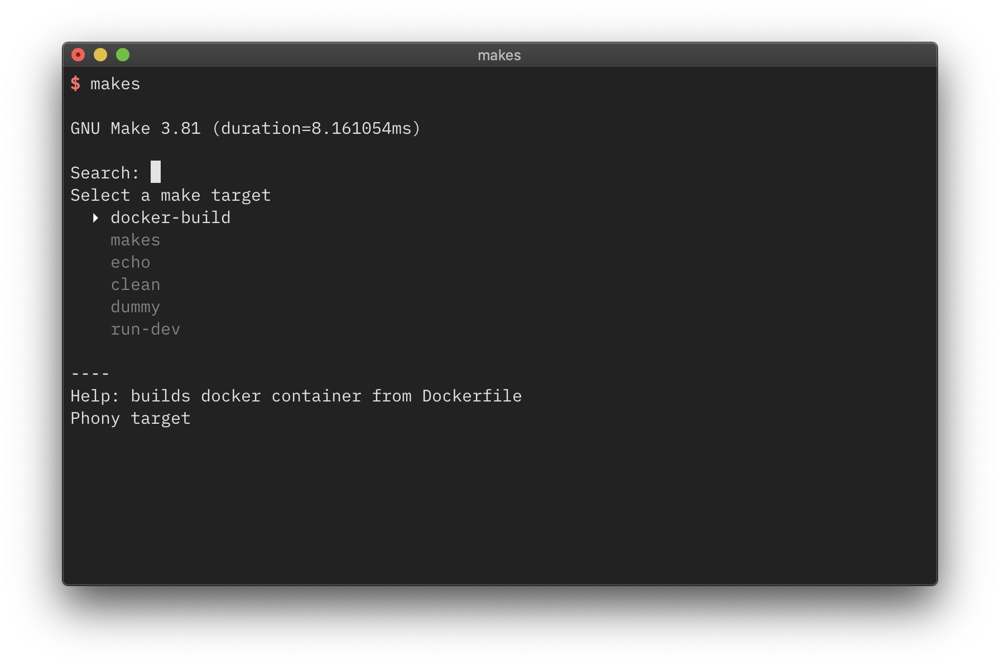

make-select
===

This is a prototype. This is currently only tested on macOS Mojave with the built-in `make`.

# What it does

When installed `makes` shows a list of available Make targets from `Makefile` in the current folder.

You can select a target using the arrow keys. If you hit Enter this target is executed.  
Search is also available, just start typing.

If a target has a "[help string](https://nedbatchelder.com/blog/201804/makefile_help_target.html)" `makes` displays this string in the lower section.